## Part 1. Установка ОС

  
Вывод версии Ubuntu  
>`cat /etc/issue`

## Part 2. Создание пользователя

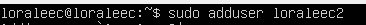  
Создание пользователя  
>`sudo adduser loraleec2`

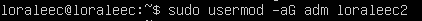  
Добавление пользователя в группу adm  
>`sudo usermod -aG adm loraleec2`

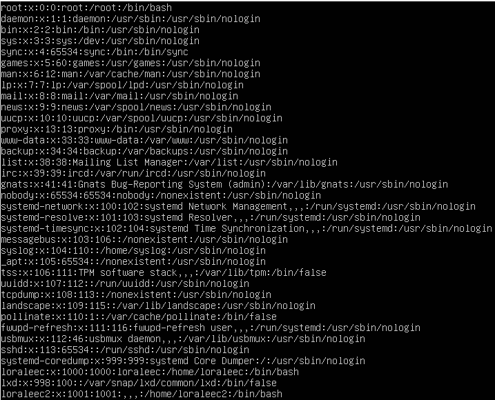  
Вывод команды cat /etc/passwd
>`cat /etc/passwd`

## Part 3. Настройка сети ОС
**Изменение имени машины**  
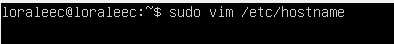  
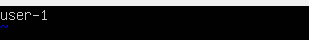  
Изменение имени на user-1 в hostname  
>`sudo vim /etc/hostname`  

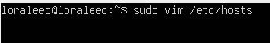  
  
Замена имени машины на user-1 в файле hosts  
>`sudo vim /etc/hosts`  

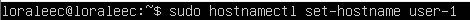  
Замена имени машины в текущей сессии  
>`sudo hostnamectl set-hostname user-1`  

**Установка временной зоны**  
  
Установка временной зоны  
>`sudo timedatectl set-timezone Europe/Moscow`  

**Сетевые интерфейсы**  
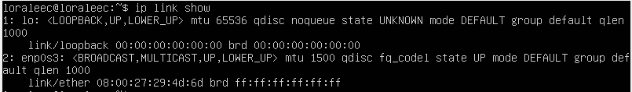  
Cетевые интерфейсы  
>`ip link show`  
>**lo (loopback device) – виртуальный интерфейс, присутствующий по умолчанию в любом Linux. Он используется для отладки сетевых программ и запуска серверных приложений на локальной машине. С этим интерфейсом всегда связан адрес 127.0.0.1.**  

**IP**  
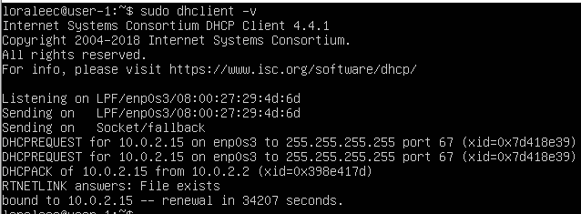  
IP адрес машины (последняя строчка)  
>`sudo dhclient -v`  
>**DHCP (Dynamic Host Configuration Protocol) - это сетевой протокол, который позволяет устройствам автоматически получать IP-адреса и другие параметры конфигурации сети от сервера DHCP.**  

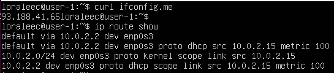  
Внешний и внутренний ip-адреса  
>`curl ifconfig.me - внешний`  
>`ip route show - внутренний`  

**Установка конфигурации вручную**  
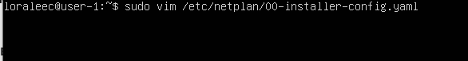  
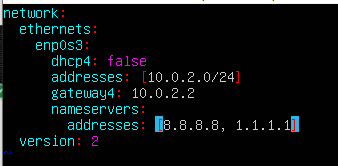  
Установка статичных IP, GW, DNS
>`sudo vim /etc/netplan/00-installer-config.yaml - открываем файл для редактирования`  

Далее редактируем его должным образом и сохраняем  
  
>`sudo netplan apply`  

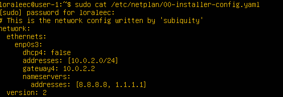  
После перезагрузки конфигурация не поменялась  

**Проверка настроек**  
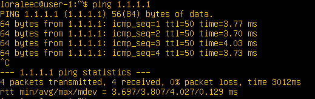  
Результат пинга 1.1.1.1  
>`ping 1.1.1.1`  

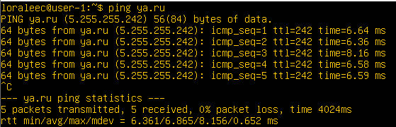  
Результат пинга ya.ru  
>`ping ya.ru`  

## Part 4. Обновление ОС
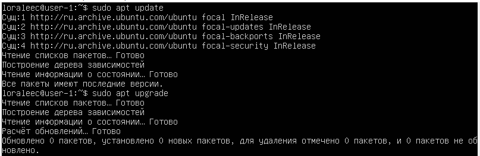  
Сообщение об отсутствие обновлений  
>`sudo apt update`  
>`sudo apt upgrade`  

## Part 5. Использование команды sudo
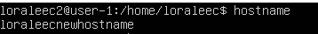  
user-1 -> loraleecnewhostname  
>Были использованы следующие команды:  
>`sudo usermod -aG sudo loraleec2`  
>`sudo hostnamectl set-hostname loraleec_new_hostname`  

>Команда sudo используется в Unix-подобных операционных системах для выполнения команд от имени суперпользователя (root), который обладает полными правами на систему.
Символически sudo расшифровывается как "Super User Do", что означает, что команда позволяет выполнить определенную задачу от имени суперпользователя. Это может включать в себя изменение системных файлов, управление службами, управление пользователями и группами и другие действия, которые требуют повышенных привилегий.
Использование sudo позволяет ограничивать доступ к выполнению команд суперпользователя только определенным пользователям, которые имеют соответствующие разрешения. Таким образом, команда sudo может использоваться для повышения безопасности и защиты системы от ошибок и злонамеренных действий.  

## Part 6. Установка и настройка службы времени
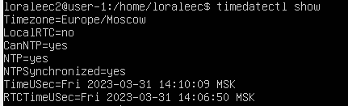  
Вывод timedatectl show до установки ntp  
>Чтобы установить службу синхронизации времени, поставим ntpdate  
>`sudo apt-get install ntpdate`  

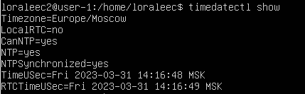  
Вывод timedatectl show после установки ntp  
>`timedatectl show`  
>Запросил время и синхронизацию, теперь время соответствует действительности.  

## Part 7. Установка и использование текстовых редакторов
**Установка редакторов и создание .txt-файлов**  
  
VIM  
>Закрытие с сохранением изменений :wq  

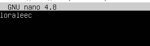  
Nano
>Закрытие с сохранением изменений - Ctrl+X, Y, Enter  

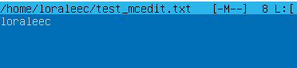  
MCEDIT  
>Закрытие с сохранением изменений - ESC, Да, Enter

**Изменение файлов и выход без сохранения изменений**  
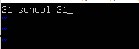  
VIM  
>Закрытие без сохранения изменений :q!  

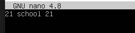  
Nano
>Закрытие без сохранения изменений - Ctrl+X, N  

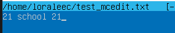  
MCEDIT  
>Закрытие без сохранения изменений - ESC, Нет, Enter  

**Поиск и замена слов в редакторах**  
**VIM**  
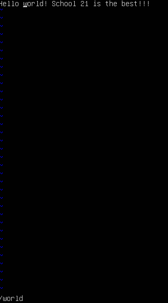  
Поиск слова "world"  
>`/world`  

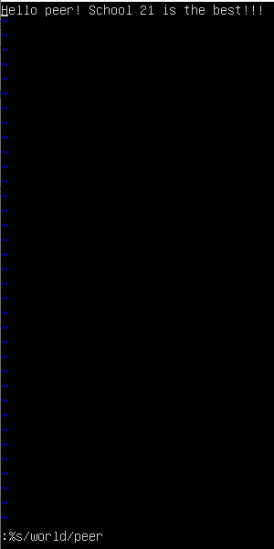  
Замена слова "world" на "peer"  
>`:%s/world/peer`  

**Nano**  
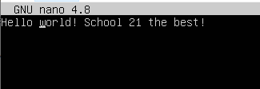  
Поиск слова "world"  
>`Ctrl+W, ввести искомое слово, нажать Enter`  

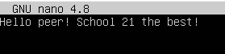  
Замена слова "world" на "peer"  
>`Ctrl+\; слово, которое нужно заменить; слово, на которое нужно заменить; Y`  

**MCEDIT**  
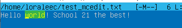  
Поиск слова "world"  
>`F7, ввести искомое слово, нажать Enter`  

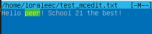  
Замена слова "world" на "peer"  
>`F4; слово, которое нужно заменить; слово, на которое нужно заменить; Enter`  

**Установка и базовая настройка сервиса SSHD**  
>`sudo apt-get install openssh-server - установка SSHd`  
>`sudo systemctl enable ssh - автостарт службы при запуске`  

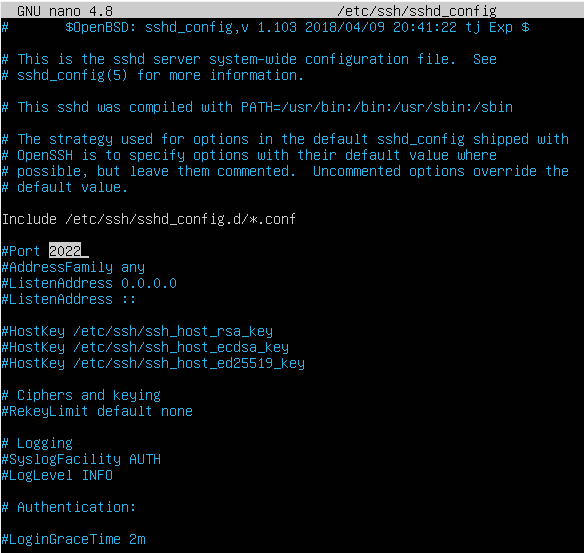  
Перенастройка службы на порт 2022  
>`sudo nano /etc/ssh/sshd_config - откроем конфигурационный файл и заменим port 22 на port 2022`  

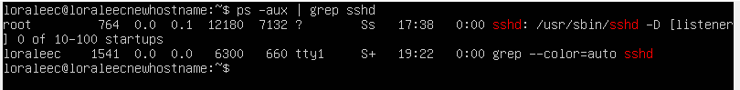
>`ps -aux | grep sshd - наличие процесса sshd`  

>Команда "ps" (от "process status") позволяет просмотреть текущие запущенные процессы в системе операционной системы Unix или Linux.  

    Ключи команды `ps`:
    * -A, -e - выбрать все процессы  
    * -a - выбрать все процессы, кроме фоновых  
    * -d - выбрать все процессы, даже фоновые, кроме процессов сессий  
    * -N - выбрать все процессы кроме указанных  
    * -С - выбирать процессы по имени команды  
    * -G - выбрать процессы по ID группы  
    * -p - выбрать процессы PID  
    * --ppid - выбрать процессы по PID родительского процесса  
    * -s - выбрать процессы по ID сессии  
    * -t - выбрать процессы по tty  
    * -u - выбрать процессы пользователя  
    * -x - найти все вхождения строки поиска  

    
    * Комбинация ключей "aux" показывает все процессы в системе, включая те, которые не связаны с терминалом, и предоставляет 
    подробную информацию о каждом процессе, включая идентификатор процесса (PID), процессорное время, использование памяти и т. д  

**Reboot**  
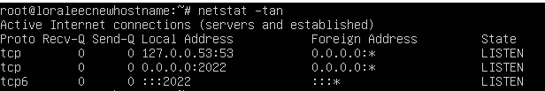  
>`netstat -tan`  

    * Ключ -tan является комбинацией трех отдельных ключей в команде netstat:

    * Ключ "-t" используется для вывода списка всех открытых TCP соединений.
    * Ключ "-a" используется для вывода списка всех активных соединений, включая те, которые находятся в состоянии прослушивания.
    * Ключ "-n" используется для вывода IP-адресов и номеров портов в числовом формате вместо их обычных именных значений.
    * В итоге, ключ -tan позволяет получить список всех открытых TCP соединений, включая те, которые находятся в состоянии прослушивания, с использованием числовых значений для * IP-адресов и номеров портов.

    * "Proto": тип протокола (например, tcp или udp)
    * "Recv-Q": количество байт, ожидающих приема для данного соединения
    * "Send-Q": количество байт, ожидающих отправки для данного соединения
    * "Local Address": локальный IP-адрес и порт для данного соединения
    * "Foreign Address": удаленный IP-адрес и порт для данного соединения
    * "State": текущее состояние соединения (например, ESTABLISHED, LISTENING, WAITING, CLOSED)
    * Значение "0.0.0.0" в столбце "Local Address" означает, что процесс, связанный с соединением, прослушивает все доступные сетевые интерфейсы и адреса на компьютере,  
    а не конкретный IP-адрес. Такое значение может быть полезным для процессов, которые должны быть доступны из любой точки сети, например, веб-серверы или FTP-серверы.

## Part 9. Установка и использование утилит top, htop  
**Утилита top**  
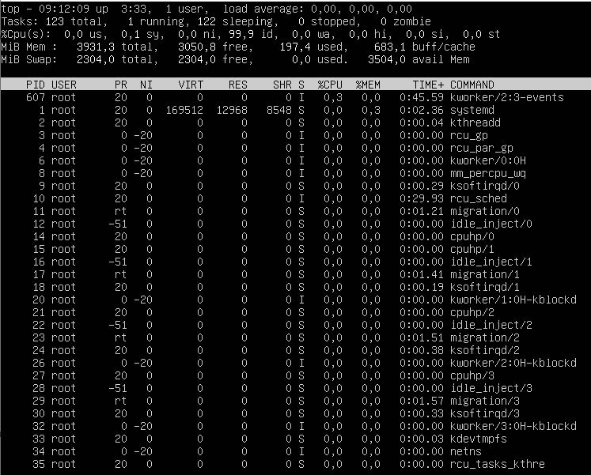  

* Uptime - 3.33  
* Количество авторизованных пользователей - 1  
* Общую загрузку системы - 0.00  
* Общее количество процессов - 123  
* Загрузка cpu - 0.0  
* Загрузку памяти - 197.4 MiB  
* PID процесса занимающего больше всего памяти - 1  
* PID процесса, занимающего больше всего процессорного времени - 607  

**Утилита htop**  
  
Сортировка по PID  

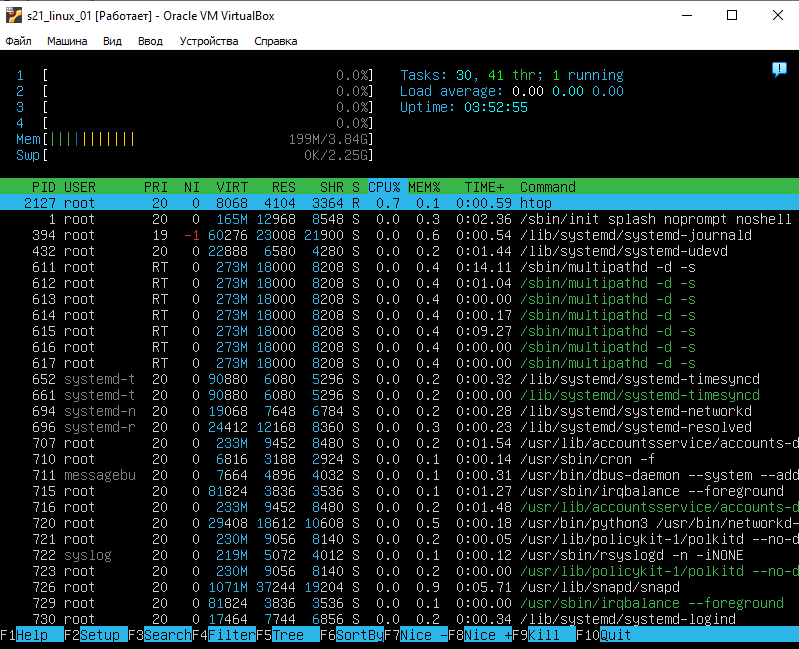  
Сортировка по PERCENT_CPU  

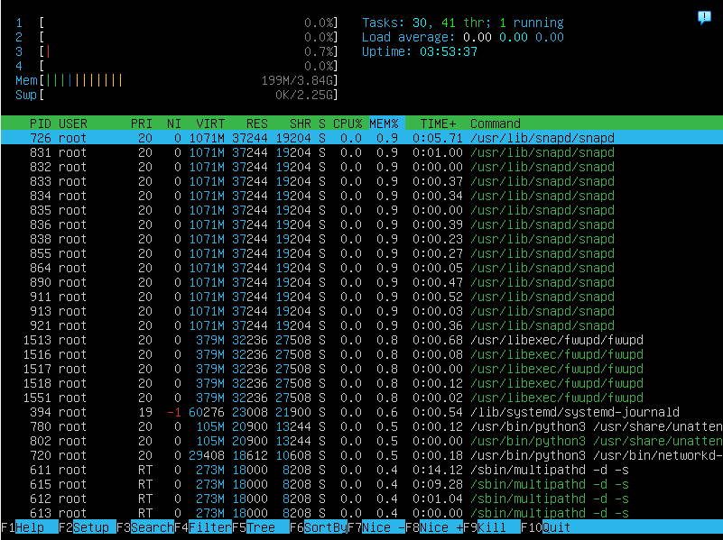  
Сортировка по PERCENT_MEM  

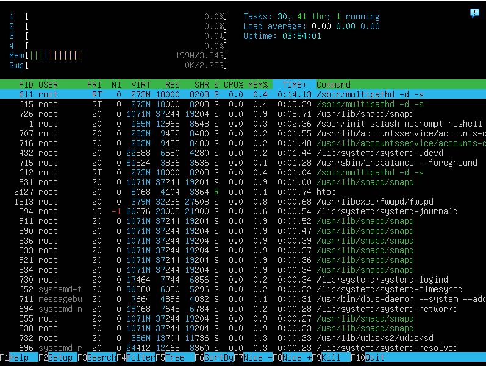  
Сортировка по TIME  

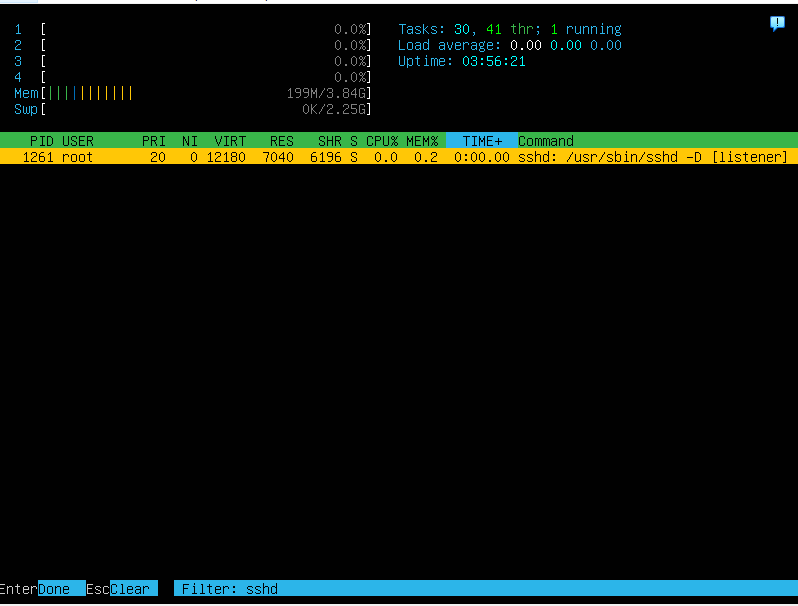  
Фильтр по SSHd  

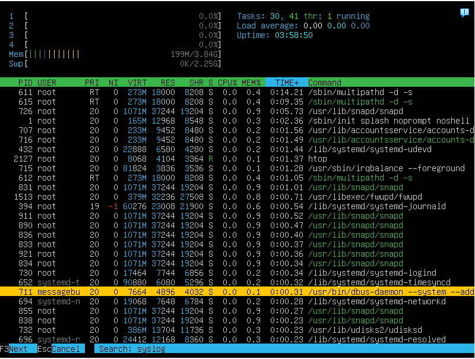  
Поиск syslog  

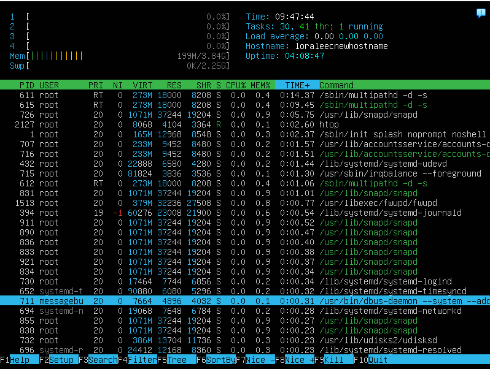  
Добавленный вывод hostname, clock и uptime  

## Part 10. Использование утилиты fdisk  
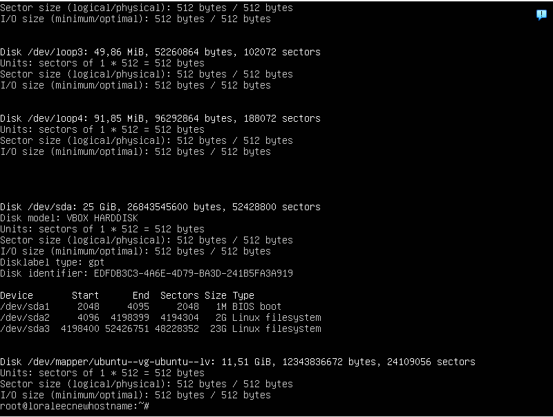  
Вывод команды fdisk -l  
  
* Название жесткого диска - VBOX HARDDISK  
* Размер жесткого диска - 25 Gib  
* Количество секторов - 52428800 секторов  

## Part 11. Использование утилиты df  
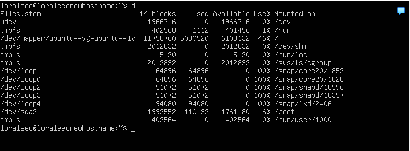  
Вывод команды df  

Корневой раздел указан, как / в последнем столбце  

* Размер раздела - 11758760 Кб = 11,75876 Гб  
* Размер занятого пространства - 5030520 Кб = 5,03052 Гб  
* Размер свободного пространства - 6109132 Кб = 6,109132 Гб  
* Процент использования - 46%  

Единица измерения - 1К-block - однокилобайтный блок, ячейка памяти, занимающая 1 килобайт. Если раздел занимает 123 таких блоков, следовательно его размер составляет 123 Кб.  

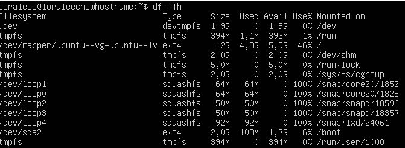  
Вывод команды df -Th  

* Размер раздела - 12 Гб 
* Размер занятого пространства - 4,8 Гб  
* Размер свободного пространства - 5,9 Гб  
* Процент использования - 46%  

Тип файловой системы находится в колонке type. Для корневого каталога это тип ext4.  

## Part 12. Использование утилиты du  
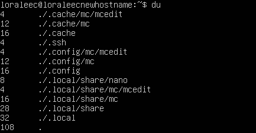  
Вывод команды du  

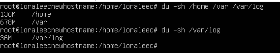  
Вывод команды du в человекочитаемом (-h) формате  

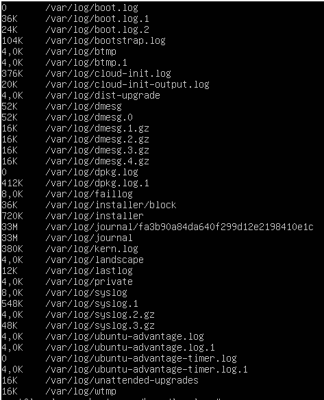  
Размер всего содержимого в var/log/  
>`du -h var/log/*`  

## Part 13. Установка и использование утилиты ncdu  
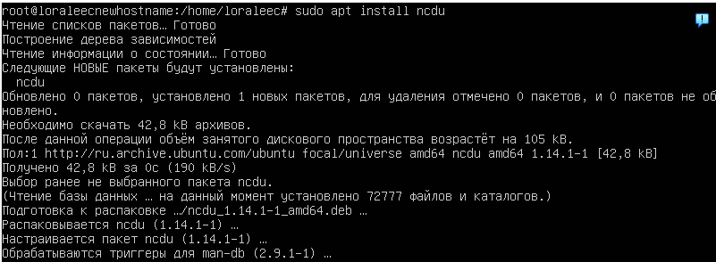  
Установка ncdu  

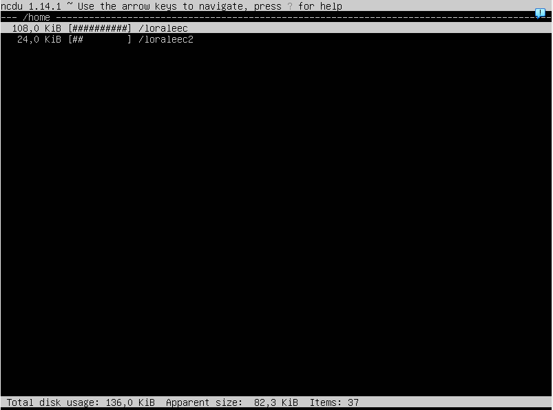  
Размер папки /home внизу экрана
>`ncdu /home`  

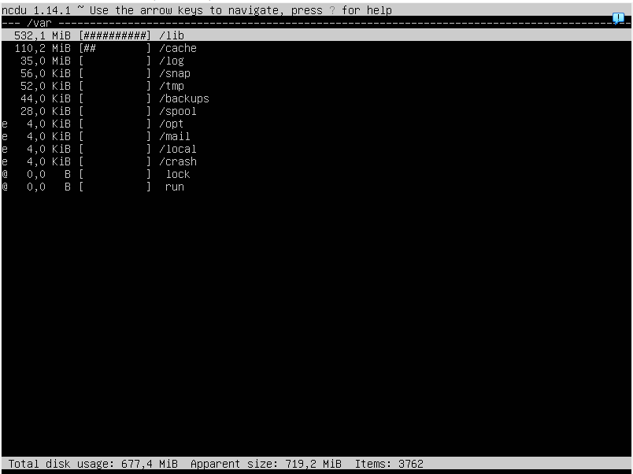  
Размер папки /var внизу экрана
>`ncdu /var`  

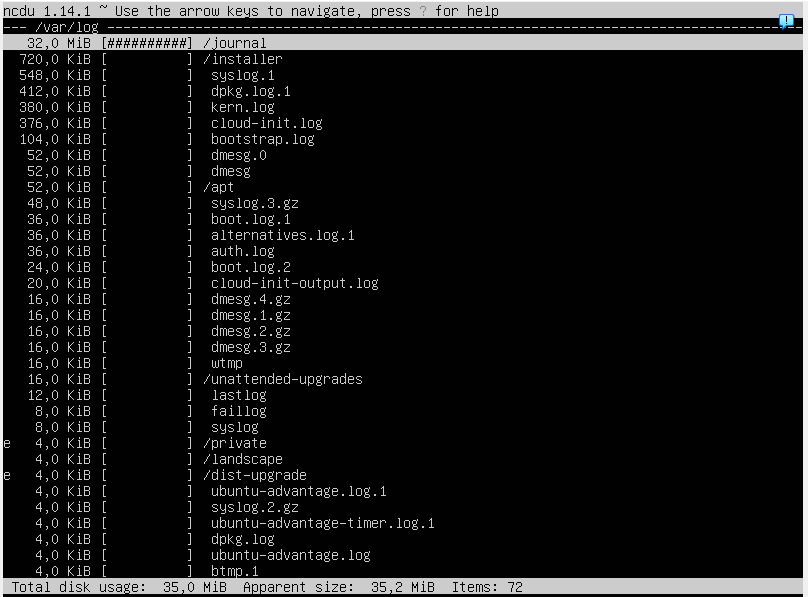  
Размер папки /var/log внизу экрана
>`ncdu /var/log`  

**Размеры папок при выводе команд ncdu и du совпадают**  

## Part 14. Работа с системными журналами  
  
Просмотр /var/log/dmesg  
>`less /var/log/dmesg`  

  
Просмотр /var/log/syslog  
>`less /var/log/syslog`  

  
Просмотр /var/log/auth.log  
>`less /var/log/auth.log`  

  
Последняя успешная авторизация  

* Время - 19.41  
* Имя пользователя - loraleec  
* Метод входа в систему - tty1 (терминал)  

  
SSHd успешно перезапущена и активна  

  
Логи о перезапуске SSHd
>`cat /var/log/syslog`  

## Part 15. Использование планировщика заданий CRON  
  
При помощи команды crontab -e и редактора Nano я настроил планировщик  

  
Список текущих задач для CRON  

  
Логи  

  
Удаление всех задач из CRON  
>`crontab -e -> удаление строчки в Nano`
